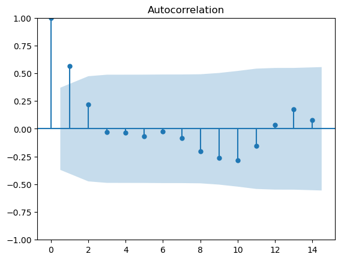

# 🌊 Coral Reef Health & Conservation – Data Science Project

**Author:** Kanna Vamshi Krishna  
**Challenge:** Lunor AI Coral Reef Health & Conservation Challenge  
**Date:** April 2025

## 🧠 Project Overview

This project analyzes and models coral reef health in the Florida Keys National Marine Sanctuary using multi-year ecological data. It was submitted for a data science challenge hosted by Lunor AI.

The key focus was to:
- Understand long-term trends in coral cover and biodiversity.
- Analyze environmental factors affecting coral reef health.
- Predict coral growth decline under simulated environmental stress (e.g., rising temperatures, macroalgae growth).

Due to system memory limitations, only a **random sample of 100,000 rows** was used from the merged datasets to ensure efficient analysis and modeling.

---

## 🛠️ Tools & Techniques Used

- Python, Pandas, NumPy
- Matplotlib, Seaborn
- Scikit-learn: Random Forest Regressor
- Time Series Decomposition
- Correlation Heatmaps
- Scenario-based Simulation

---

## 📈 Key Highlights

- Analyzed 7+ complex ecological datasets
- Built models to predict coral diameter changes (proxy for health)
- Explored relationships between temperature, algae, and coral health
- Found weak correlations and low predictive power (R² ≈ -0.01), suggesting complex, non-linear relationships

---

## 📊 Visual Insights (Objectives)

### Objective 1 – Spatial Distribution of Species

---

### Objective 2 – Mortality vs. Coral Height

---

### Objective 3 – Benthic Composition Over Time

---

### Objective 4 – Habitat-based Species Trends

---

### Objective 5 – Environmental Impact on Coral Health

---

## 🧪 Scenario Simulations

| Scenario | Change Applied | Result (∆ in Coral Diameter) |
|----------|----------------|------------------------------|
| +2°C Temperature | TempC increased by 2°C | -0.0072 |
| +50% Macroalgae | Macroalgae increased by 50% | -0.0001 |

---

## 🔍 Key Learnings

- Real-world ecological data often lacks strong linear relationships
- Clear storytelling and structured analysis matter, especially when modeling results are limited
- Handling memory and performance constraints is a critical data science skill

---

## 📂 Files Included

- `coral_reef_challenge_kanna_vamshi_krishna_code_file.ipynb`: Full Jupyter notebook
- `Coral Reef_Health_and_Conservation_Report_kanna_vamshi_krishna.pdf`: Final PDF report
- `CREMP_Pcover_2023_TaxaGroups.csv`: Dataset containing taxonomic group cover data for coral reefs.
- `CREMP_Pcover_2023_StonyCoralSpecies.csv`: Dataset with data on stony coral species in the Florida Keys.
- `CREMP_SCOR_RawData_2023.csv`: Raw ecological data for coral reef surveys.
- `CREMP_SCOR_Summaries_2023_ConditionCounts.csv`: Summarized data on coral conditions and counts.
- `CREMP_Temperatures_2023.csv`: Temperature data related to the coral reef environment.
- `lunor_ai_graphs/`: Folder containing key visualizations from each objective.

---

## 📬 Connect with Me

Feel free to connect on [LinkedIn](https://www.linkedin.com/in/kanna-vamshi-krishna-datascience)  
Visit my portfolio: [GitHub](https://github.com/kanna-vamshi-krishna)
