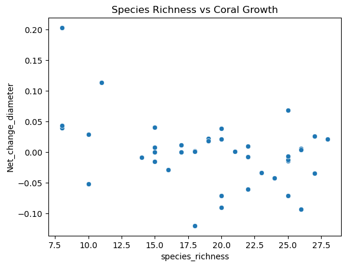

# 🌊 Coral Reef Health & Conservation – Data Science Project

**Author:** Kanna Vamshi Krishna  
**Challenge:** Lunor AI Coral Reef Health & Conservation Challenge  
**Date:** April 2025

## 🧠 Project Overview

This project analyzes and models coral reef health in the Florida Keys National Marine Sanctuary using multi-year ecological data. It was submitted for a data science challenge hosted by Lunor AI.

The key focus was to:
- Understand long-term trends in coral cover and biodiversity.
- Analyze environmental factors affecting coral reef health.
- Predict coral growth decline under simulated environmental stress (e.g., rising temperatures, macroalgae growth).

Due to system memory limitations, only a **random sample of 100,000 rows** was used from the merged datasets to ensure efficient analysis and modeling.

---

## 🎯 Project Objectives

1. Determine **long-term trends** in stony coral percent cover and species richness.
2. Evaluate **net changes** in reef community parameters sanctuary-wide.
3. Identify **localized variations vs. broad-scale ecosystem changes**.
4. Examine **correlations** and environmental relationships impacting coral health and biodiversity.
5. Model **future scenarios** to anticipate and mitigate potential declines in coral communities.

---

## 🛠️ Tools & Techniques Used

- Python, Pandas, NumPy
- Matplotlib, Seaborn
- Scikit-learn: Random Forest Regressor
- Time Series Decomposition
- Correlation Heatmaps
- Scenario-based Simulation

---

## 📈 Key Highlights

- Analyzed 7+ complex ecological datasets
- Built models to predict coral diameter changes (proxy for health)
- Explored relationships between temperature, algae, and coral health
- Found weak correlations and low predictive power (R² ≈ -0.01), suggesting complex, non-linear relationships

---

## 🎯 Objective-wise Visual Analysis

### ✅ Objective 1 – Long-term Trends in Coral Cover & Species Richness

**Coral Cover Over Years**

**Species Richness Over Years**

---

### ✅ Objective 2 – Net Changes in Reef Parameters Sanctuary-wide

---

### ✅ Objective 3 – Localized vs Broad-Scale Ecosystem Changes

**Stony Coral Trends: Subregions vs Sanctuary**

---

### ✅ Objective 4 – Correlations Impacting Coral Health & Biodiversity

**Correlation Heatmap: Environmental Factors vs Coral Metrics**
  
  

---

### ✅ Objective 5 – Future Scenario Modeling (Stress Simulations)

| Scenario | Change Applied | Result (∆ in Coral Diameter) |
|----------|----------------|------------------------------|
| +2°C Temperature | TempC increased by 2°C | -0.0072 |
| +50% Macroalgae | Macroalgae increased by 50% | -0.0001 |

---

## 🔍 Time Series Decomposition

To observe **seasonality and trends**, time series decomposition was applied to average coral parameters across years.

- **Trend component** showed a **slow decline** in stony coral cover.
- No clear **seasonality** observed, as data is annual.

---

## 🔍 Key Learnings

- Real-world ecological data often lacks strong linear relationships
- Clear storytelling and structured analysis matter, especially when modeling results are limited
- Handling memory and performance constraints is a critical data science skill

---

## 💡 Key Challenges Faced

- **Dataset volume** and memory constraints were tackled via sampling.
- **Multisource data integration** required careful key selection and joins.
- **Weak model performance** highlighted the limitations of using only structured features for ecological predictions.

---

## 💼 Project Learnings

- Real-world ecological data demands **multi-disciplinary thinking**.
- Importance of **ecological domain knowledge** in interpreting weak model scores.
- Emphasis on **storytelling** and structured exploration, even when model outcomes are limited.

---

## 📂 Files Included

- `coral_reef_challenge_kanna_vamshi_krishna_code_file.ipynb`: Full Jupyter notebook
- `Coral Reef_Health_and_Conservation_Report_kanna_vamshi_krishna.pdf`: Final PDF report
- `CREMP_Pcover_2023_TaxaGroups.csv`: Dataset containing taxonomic group cover data for coral reefs.
- `CREMP_Pcover_2023_StonyCoralSpecies.csv`: Dataset with data on stony coral species in the Florida Keys.
- `CREMP_SCOR_RawData_2023.csv`: Raw ecological data for coral reef surveys.
- `CREMP_SCOR_Summaries_2023_ConditionCounts.csv`: Summarized data on coral conditions and counts.
- `CREMP_Temperatures_2023.csv`: Temperature data related to the coral reef environment.

---

## 📬 Connect with Me

Feel free to connect on [LinkedIn](https://www.linkedin.com/in/kanna-vamshi-krishna-datascience)  
Visit my portfolio: [GitHub](https://github.com/kanna-vamshi-krishna)
